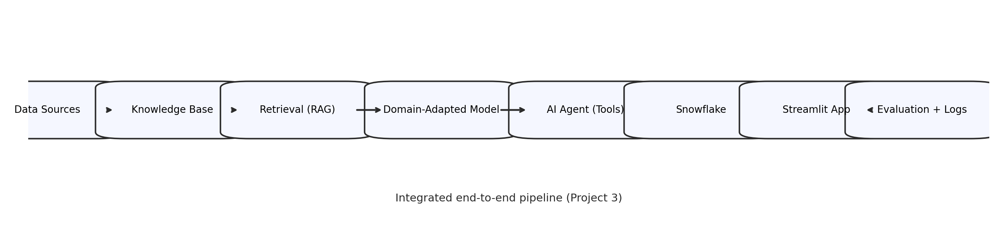

# Project 3 Integrated Folder

This repository contains a **single integrated GenAI system** for Project 3.
It was organized by merging and adapting work from these source repositories:

- `LAB_6/lab6_agent_antigravity`
- `LAB_7`
- `lab_8/Lab8_Individual_Submission_Adrija`
- `lab_9/Lab8_Individual_Submission_Adrija`

## Purpose

This folder integrates:
- **Lab 6:** agent reasoning and tool integration
- **Lab 7:** reproducibility and environment automation
- **Lab 8:** domain adaptation / LoRA artifacts
- **Lab 9:** application enhancement, monitoring, deployment
- **Project 2 foundation:** dataset, retrieval, Snowflake, Streamlit app

## Quickstart

- Install + run instructions: see `RUN.md`
- One-command reproducibility: `bash reproduce.sh`

Main runnable entrypoints:
- Backend (FastAPI): `uvicorn integrated_system.app.api:app --reload --port 8000`
- Frontend (Streamlit): `streamlit run integrated_system/app/app.py`
- Evaluation: `python -m integrated_system.evaluation.evaluate_pipeline`

## Final expected pipeline

Data Sources -> Knowledge Base -> Retrieval -> Domain-Adapted Model -> Agent Layer -> Snowflake -> Streamlit/FastAPI App -> Monitoring/Evaluation

## Architecture diagram (required)

## Where things live

- Architecture diagram (Mermaid): `docs/SYSTEM_ARCHITECTURE.md`
- Integrated implementation: `integrated_system/`
- Rubric-friendly folder layout: `src/` (thin wrappers pointing to `integrated_system/`)
