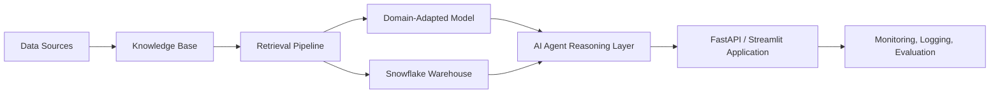

# System Architecture

## Component placement in this folder
- `integrated_system/retrieval/` -> retrieval pipeline
- `integrated_system/domain_adaptation/` -> LoRA / PEFT work
- `integrated_system/agent/` -> agent logic and tools
- `integrated_system/warehouse/` -> Snowflake code
- `integrated_system/app/` -> API + Streamlit UI
- `integrated_system/evaluation/` -> benchmarks and example outputs
- `integrated_system/deployment/` -> Render/Railway deployment files
